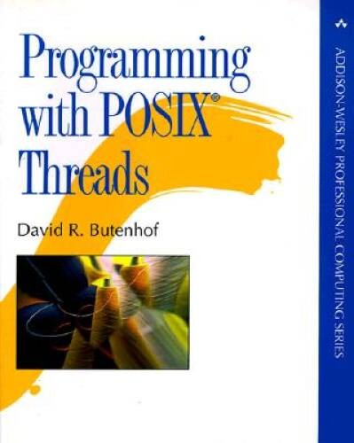

# Butenhof

Exploring multithreaded applications including mutexes and condition variables with POSIX
threads following _Programming with POSIX threads_ by David R. Butenhof.

<div align="center">
    
</div>

## CMake

The project has been initialized with a [CMakeLists.txt](CMakeLists.txt)-based
configuration for building with CMake:

```console
# make a build directory
$ mkdir build

# change into the build directory
$ cd build/

# generate the build files
$ cmake -DCMAKE_BUILD_TYPE=Debug ..

# build the project
$ cmake --build .

# install the project to <repo>/build/dist
$ cmake --install . --prefix dist/
```

## `bank`

`bank` is a program that illustrates the use of mutexes to control access to data shared
between threads, in this case a bank account.

```console
$ ./dist/bin/bank
Concurrently increment a shared variable a=0 one million times in each of 4 threads
a=4000000
```

## `barrier`

Program `barrier` updates each position of a string at different rates, but using
a barrier, they still stay in sync:

```console
$ ./dist/bin/barrier
Concurrently update each character in a string, but use
a barrier to synchronize each thread
> ffff
```

## `cancel`

Program `cancel` illustrates how to cancel a running thread and clean up the resources it was using.

```console
$ ./dist/bin/cancel
Making a compute bound loop cancelable, with cleanup of resources
0
1
Canceling compute-bound thread now...
2
Starting the cleanup...
Done with the cleanup
Compute-bound thread was canceled as expected.
```

## `client-server`

Program `client-server` illustrates how multiple client threads within an application may send
requests to a server thread, as a way to synchronize access to e.g. stdin

```console
$ ./dist/bin/client-server 
Use multiple client threads to make both synchronous and
asynchronous requests to a server.
client 2 wants to know, what is your message?
 > asdf
client 1 wants to know, what is your message?
 > qwer
client 2, loop 1 / 4: asdf
client 1, loop 1 / 4: qwer
client 2, loop 2 / 4: asdf
client 4 wants to know, what is your message?
 > zxcv
client 1, loop 2 / 4: qwer
client 2, loop 3 / 4: asdf
client 3 wants to know, what is your message?
 > ghjk
client 1, loop 3 / 4: qwer
client 2, loop 4 / 4: asdf
client 1, loop 4 / 4: qwer
client 4, loop 1 / 4: zxcv
client 4, loop 2 / 4: zxcv
client 4, loop 3 / 4: zxcv
client 3, loop 1 / 4: ghjk
client 4, loop 4 / 4: zxcv
client 3, loop 2 / 4: ghjk
client 3, loop 3 / 4: ghjk
client 3, loop 4 / 4: ghjk
```

## `crew`

Program `crew` illustrates the concept of a work crew, where members of the crew take
work from a queue and also push new work onto it for any thread to pick up later.

```console
$ ./dist/bin/crew
hello from main
hello from thread 2
hello from thread 3
hello from thread 1
hello from thread 4
thread  3 pushed        383
thread  2 pushed        286
thread  1 pushed        177
thread  4 pushed        415
thread  1        popped 383
thread  1 pushed        193
thread  2        popped 286
thread  2 pushed        235
thread  1        popped 177
thread  1 pushed        186
thread  3        popped 415
thread  3 pushed        392
thread  1        popped 193
thread  1 pushed        149
thread  4        popped 235
thread  4 pushed        421
thread  2        popped 186
thread  2 pushed        262
thread  1        popped 392
thread  1 pushed        127
thread  1        popped 149
thread  1 pushed        190
thread  3        popped 421
thread  3 pushed        359
thread  2        popped 262
thread  2 pushed        263
thread  1        popped 127
thread  1 pushed        126
thread  1        popped 190
thread  1 pushed        140
thread  4        popped 359
thread  4 pushed        426
thread  2        popped 263
thread  2 pushed        272
thread  1        popped 126
thread  1 pushed        136
thread  3        popped 140
thread  3 pushed        311
thread  1        popped 426
thread  1 pushed        168
thread  2        popped 272
bye from thread 2
thread  1        popped 136
bye from thread 1
thread  4        popped 311
bye from thread 4
thread  3        popped 168
bye from thread 3
bye from main
```

## `hello`

Output should be something like below. Program `hello` illustrates multiple threads
concurrently saying hello.

```console
$ ./dist/bin/hello
hello from main
hello from thread 3
hello from thread 1
hello from thread 0
hello from thread 2
goodbye from thread 1
goodbye from thread 3
goodbye from thread 2
goodbye from thread 0
goodbye from main
```

## philosophers

Program that illustrates the dining philosophers problem.

```console
$ ./dist/bin/philosophers 
philosopher 0 has acquired the first fork    (id = 0x578fdbd002a0)
philosopher 0 has acquired the second fork   (id = 0x578fdbd002c8)
philosopher 0 starts eating bite 1 of 6
philosopher 1 has acquired the first fork    (id = 0x578fdbd002f0)
philosopher 3 has acquired the first fork    (id = 0x578fdbd00340)
philosopher 3 has acquired the second fork   (id = 0x578fdbd00318)
philosopher 3 starts eating bite 1 of 6
philosopher 3 done eating bite 1 of 6
philosopher 3 has released their second fork (id = 0x578fdbd00318)
philosopher 3 has released their first fork  (id = 0x578fdbd00340)
philosopher 3 is thinking
philosopher 4 has acquired the first fork    (id = 0x578fdbd00340)
philosopher 0 done eating bite 1 of 6
philosopher 0 has released their second fork (id = 0x578fdbd002c8)
philosopher 0 has released their first fork  (id = 0x578fdbd002a0)
philosopher 0 is thinking
philosopher 1 has acquired the second fork   (id = 0x578fdbd002c8)
philosopher 1 starts eating bite 1 of 4
philosopher 4 has acquired the second fork   (id = 0x578fdbd002a0)
philosopher 4 starts eating bite 1 of 4
philosopher 1 done eating bite 1 of 4
philosopher 1 has released their second fork (id = 0x578fdbd002c8)
philosopher 1 has released their first fork  (id = 0x578fdbd002f0)
philosopher 1 is thinking
philosopher 2 has acquired the first fork    (id = 0x578fdbd002f0)
philosopher 2 has acquired the second fork   (id = 0x578fdbd00318)
philosopher 2 starts eating bite 1 of 2
philosopher 4 done eating bite 1 of 4
philosopher 4 has released their second fork (id = 0x578fdbd002a0)
philosopher 4 has released their first fork  (id = 0x578fdbd00340)
philosopher 4 is thinking
philosopher 3 has acquired the first fork    (id = 0x578fdbd00340)
philosopher 2 done eating bite 1 of 2
philosopher 2 has released their second fork (id = 0x578fdbd00318)
philosopher 2 has released their first fork  (id = 0x578fdbd002f0)
philosopher 2 is thinking
philosopher 3 has acquired the second fork   (id = 0x578fdbd00318)
philosopher 3 starts eating bite 2 of 6
philosopher 0 has acquired the first fork    (id = 0x578fdbd002a0)
philosopher 0 has acquired the second fork   (id = 0x578fdbd002c8)
philosopher 0 starts eating bite 2 of 6
philosopher 1 has acquired the first fork    (id = 0x578fdbd002f0)
philosopher 3 done eating bite 2 of 6
philosopher 3 has released their second fork (id = 0x578fdbd00318)
philosopher 3 has released their first fork  (id = 0x578fdbd00340)
philosopher 3 is thinking
philosopher 4 has acquired the first fork    (id = 0x578fdbd00340)
philosopher 0 done eating bite 2 of 6
philosopher 0 has released their second fork (id = 0x578fdbd002c8)
philosopher 0 has released their first fork  (id = 0x578fdbd002a0)
philosopher 0 is thinking
philosopher 1 has acquired the second fork   (id = 0x578fdbd002c8)
philosopher 1 starts eating bite 2 of 4
philosopher 4 has acquired the second fork   (id = 0x578fdbd002a0)
philosopher 4 starts eating bite 2 of 4
philosopher 1 done eating bite 2 of 4
philosopher 1 has released their second fork (id = 0x578fdbd002c8)
philosopher 1 has released their first fork  (id = 0x578fdbd002f0)
philosopher 1 is thinking
philosopher 2 has acquired the first fork    (id = 0x578fdbd002f0)
philosopher 2 has acquired the second fork   (id = 0x578fdbd00318)
philosopher 2 starts eating bite 2 of 2
philosopher 2 done eating bite 2 of 2
philosopher 2 has released their second fork (id = 0x578fdbd00318)
philosopher 2 has released their first fork  (id = 0x578fdbd002f0)
philosopher 2 is thinking
philosopher 1 has acquired the first fork    (id = 0x578fdbd002f0)
philosopher 1 has acquired the second fork   (id = 0x578fdbd002c8)
philosopher 1 starts eating bite 3 of 4
philosopher 4 done eating bite 2 of 4
philosopher 4 has released their second fork (id = 0x578fdbd002a0)
philosopher 4 has released their first fork  (id = 0x578fdbd00340)
philosopher 4 is thinking
philosopher 0 has acquired the first fork    (id = 0x578fdbd002a0)
philosopher 3 has acquired the first fork    (id = 0x578fdbd00340)
philosopher 3 has acquired the second fork   (id = 0x578fdbd00318)
philosopher 3 starts eating bite 3 of 6
philosopher 1 done eating bite 3 of 4
philosopher 1 has released their second fork (id = 0x578fdbd002c8)
philosopher 1 has released their first fork  (id = 0x578fdbd002f0)
philosopher 1 is thinking
philosopher 2 is done
philosopher 0 has acquired the second fork   (id = 0x578fdbd002c8)
philosopher 0 starts eating bite 3 of 6
philosopher 1 has acquired the first fork    (id = 0x578fdbd002f0)
philosopher 3 done eating bite 3 of 6
philosopher 3 has released their second fork (id = 0x578fdbd00318)
philosopher 3 has released their first fork  (id = 0x578fdbd00340)
philosopher 3 is thinking
philosopher 4 has acquired the first fork    (id = 0x578fdbd00340)
philosopher 0 done eating bite 3 of 6
philosopher 0 has released their second fork (id = 0x578fdbd002c8)
philosopher 0 has released their first fork  (id = 0x578fdbd002a0)
philosopher 0 is thinking
philosopher 1 has acquired the second fork   (id = 0x578fdbd002c8)
philosopher 1 starts eating bite 4 of 4
philosopher 4 has acquired the second fork   (id = 0x578fdbd002a0)
philosopher 4 starts eating bite 3 of 4
philosopher 1 done eating bite 4 of 4
philosopher 1 has released their second fork (id = 0x578fdbd002c8)
philosopher 1 has released their first fork  (id = 0x578fdbd002f0)
philosopher 1 is thinking
philosopher 4 done eating bite 3 of 4
philosopher 4 has released their second fork (id = 0x578fdbd002a0)
philosopher 4 has released their first fork  (id = 0x578fdbd00340)
philosopher 4 is thinking
philosopher 3 has acquired the first fork    (id = 0x578fdbd00340)
philosopher 3 has acquired the second fork   (id = 0x578fdbd00318)
philosopher 3 starts eating bite 4 of 6
philosopher 0 has acquired the first fork    (id = 0x578fdbd002a0)
philosopher 0 has acquired the second fork   (id = 0x578fdbd002c8)
philosopher 0 starts eating bite 4 of 6
philosopher 1 is done
philosopher 0 done eating bite 4 of 6
philosopher 0 has released their second fork (id = 0x578fdbd002c8)
philosopher 0 has released their first fork  (id = 0x578fdbd002a0)
philosopher 0 is thinking
philosopher 3 done eating bite 4 of 6
philosopher 3 has released their second fork (id = 0x578fdbd00318)
philosopher 3 has released their first fork  (id = 0x578fdbd00340)
philosopher 3 is thinking
philosopher 4 has acquired the first fork    (id = 0x578fdbd00340)
philosopher 4 has acquired the second fork   (id = 0x578fdbd002a0)
philosopher 4 starts eating bite 4 of 4
philosopher 4 done eating bite 4 of 4
philosopher 4 has released their second fork (id = 0x578fdbd002a0)
philosopher 4 has released their first fork  (id = 0x578fdbd00340)
philosopher 4 is thinking
philosopher 0 has acquired the first fork    (id = 0x578fdbd002a0)
philosopher 0 has acquired the second fork   (id = 0x578fdbd002c8)
philosopher 0 starts eating bite 5 of 6
philosopher 3 has acquired the first fork    (id = 0x578fdbd00340)
philosopher 3 has acquired the second fork   (id = 0x578fdbd00318)
philosopher 3 starts eating bite 5 of 6
philosopher 4 is done
philosopher 3 done eating bite 5 of 6
philosopher 3 has released their second fork (id = 0x578fdbd00318)
philosopher 3 has released their first fork  (id = 0x578fdbd00340)
philosopher 3 is thinking
philosopher 0 done eating bite 5 of 6
philosopher 0 has released their second fork (id = 0x578fdbd002c8)
philosopher 0 has released their first fork  (id = 0x578fdbd002a0)
philosopher 0 is thinking
philosopher 3 has acquired the first fork    (id = 0x578fdbd00340)
philosopher 3 has acquired the second fork   (id = 0x578fdbd00318)
philosopher 3 starts eating bite 6 of 6
philosopher 0 has acquired the first fork    (id = 0x578fdbd002a0)
philosopher 0 has acquired the second fork   (id = 0x578fdbd002c8)
philosopher 0 starts eating bite 6 of 6
philosopher 3 done eating bite 6 of 6
philosopher 3 has released their second fork (id = 0x578fdbd00318)
philosopher 3 has released their first fork  (id = 0x578fdbd00340)
philosopher 3 is thinking
philosopher 0 done eating bite 6 of 6
philosopher 0 has released their second fork (id = 0x578fdbd002c8)
philosopher 0 has released their first fork  (id = 0x578fdbd002a0)
philosopher 0 is thinking
philosopher 3 is done
philosopher 0 is done
```

## `pipeline`

`pipeline` is a program that illustrates pipelining, with threadsafe ring buffer queues
in between each stage of the pipeline. This example builds on the examples that use
mutexes and condition variables.

```
$ ./dist/bin/pipeline
vin 0: spawned
vin 0: start installing frame
vin 1: spawned
vin 2: spawned
vin 0: completed installing frame
vin 1: start installing frame
vin 0: start installing engine
vin 3: spawned
vin 0: completed installing engine
vin 0: start installing body
vin 1: completed installing frame
vin 2: start installing frame
thread 'source' complete
vin 1: start installing engine
vin 2: completed installing frame
vin 3: start installing frame
vin 0: completed installing body
vin 0: start installing wheels
vin 1: completed installing engine
vin 2: start installing engine
vin 1: start installing body
vin 1: completed installing body
vin 2: completed installing engine
vin 0: completed installing wheels
vin 1: start installing wheels
vin 2: start installing body
vin 0: complete
vin 3: completed installing frame
thread 'install_frame' complete
vin 3: start installing engine
vin 2: completed installing body
vin 1: completed installing wheels
vin 2: start installing wheels
vin 1: complete
vin 3: completed installing engine
thread 'install_engine' complete
vin 3: start installing body
vin 2: completed installing wheels
vin 2: complete
vin 3: completed installing body
thread 'install_body' complete
vin 3: start installing wheels
vin 3: completed installing wheels
thread 'install_wheels' complete
vin 3: complete
thread 'sink' complete
```

## `pool`

```console
...
```

## `rwlock`

Program `rwlock` illustrates how to use a read-write lock on some data `value`, where multiple
threads can read the value concurrently, but only one thread can have write access at any given
time.

```console
$ ./dist/bin/rwlock
Reading and writing a rwlock protected value using multiple threads
thread_id|reading|writing|done|value
---------|-------|-------|----|-----
        0|reading|       |    |    0
        1|reading|       |    |    0
        2|reading|       |    |    0
        3|reading|       |    |    0
        4|reading|       |    |    0
        5|reading|       |    |    0
        6|reading|       |    |    0
        7|reading|       |    |    0
        8|reading|       |    |    0
        9|reading|       |    |    0
        0|reading|       |    |    0
        3|reading|       |    |    0
        1|reading|       |    |    0
        2|reading|       |    |    0
        4|reading|       |    |    0
        6|reading|       |    |    0
        7|reading|       |    |    0
        9|reading|       |    |    0
        8|reading|       |    |    0
        5|       |writing|    |    1
        0|reading|       |    |    1
        6|reading|       |    |    1
        3|reading|       |    |    1
        7|reading|       |    |    1
        4|reading|       |    |    1
        9|reading|       |    |    1
        8|reading|       |    |    1
        2|reading|       |    |    1
        1|       |writing|    |    2
        4|reading|       |    |    2
        9|reading|       |    |    2
        2|reading|       |    |    2
        8|reading|       |    |    2
        5|reading|       |    |    2
        0|reading|       |    |    2
        6|reading|       |    |    2
        7|reading|       |    |    2
        3|reading|       |    |    2
        1|       |writing|    |    3
        5|reading|       |    |    3
        8|reading|       |    |    3
        3|reading|       |    |    3
        6|reading|       |    |    3
        4|reading|       |    |    3
        0|reading|       |    |    3
        9|reading|       |    |    3
        2|reading|       |    |    3
        7|       |writing|    |    4
        4|reading|       |    |    4
        2|reading|       |    |    4
        8|reading|       |    |    4
        9|reading|       |    |    4
        6|reading|       |    |    4
        0|reading|       |    |    4
        3|reading|       |    |    4
        5|reading|       |    |    4
        1|reading|       |    |    4
        7|reading|       |    |    4
        4|reading|       |    |    4
        0|reading|       |    |    4
        3|reading|       |    |    4
        6|reading|       |    |    4
        8|reading|       |    |    4
        9|reading|       |    |    4
        2|reading|       |    |    4
        5|reading|       |    |    4
        1|reading|       |    |    4
        7|reading|       |    |    4
        4|reading|       |    |    4
        9|reading|       |    |    4
        8|reading|       |    |    4
        1|reading|       |    |    4
        3|reading|       |    |    4
        2|reading|       |    |    4
        6|reading|       |    |    4
        5|reading|       |    |    4
        0|reading|       |    |    4
        7|reading|       |    |    4
        2|reading|       |    |    4
        9|reading|       |    |    4
        4|reading|       |    |    4
        6|reading|       |    |    4
        8|reading|       |    |    4
        3|reading|       |    |    4
        1|reading|       |    |    4
        0|       |writing|    |    5
        3|reading|       |    |    5
        7|reading|       |    |    5
        2|reading|       |    |    5
        9|reading|       |    |    5
        6|reading|       |    |    5
        8|reading|       |    |    5
        1|reading|       |    |    5
        5|       |writing|    |    6
        3|reading|       |    |    6
        2|reading|       |    |    6
        8|reading|       |    |    6
        7|reading|       |    |    6
        0|reading|       |    |    6
        1|reading|       |    |    6
        6|reading|       |    |    6
        9|reading|       |    |    6
        4|       |writing|    |    7
        8|reading|       |    |    7
        7|reading|       |    |    7
        6|reading|       |    |    7
        5|reading|       |    |    7
        3|reading|       |    |    7
        9|reading|       |    |    7
        1|reading|       |    |    7
        0|reading|       |    |    7
        2|reading|       |    |    7
        4|       |writing|    |    8
        6|reading|       |    |    8
        0|reading|       |    |    8
        3|reading|       |    |    8
        2|reading|       |    |    8
        8|reading|       |    |    8
        9|reading|       |    |    8
        5|reading|       |    |    8
        1|reading|       |    |    8
        7|       |writing|    |    9
        3|reading|       |    |    9
        2|reading|       |    |    9
        6|reading|       |    |    9
        0|reading|       |    |    9
        4|reading|       |    |    9
        8|reading|       |    |    9
        9|reading|       |    |    9
        5|reading|       |    |    9
        1|reading|       |    |    9
        7|reading|       |    |    9
        3|reading|       |    |    9
        2|reading|       |    |    9
        6|reading|       |    |    9
        0|reading|       |    |    9
        9|reading|       |    |    9
        1|reading|       |    |    9
        5|reading|       |    |    9
        4|reading|       |    |    9
        8|reading|       |    |    9
        7|reading|       |    |    9
        2|reading|       |    |    9
        0|reading|       |    |    9
        3|reading|       |    |    9
        6|reading|       |    |    9
        9|reading|       |    |    9
        8|reading|       |    |    9
        4|reading|       |    |    9
        1|       |writing|    |   10
        6|reading|       |    |   10
        3|reading|       |    |   10
        2|reading|       |    |   10
        8|reading|       |    |   10
        7|reading|       |    |   10
        4|reading|       |    |   10
        0|reading|       |    |   10
        5|       |writing|    |   11
        3|reading|       |    |   11
        0|reading|       |    |   11
        4|reading|       |    |   11
        7|reading|       |    |   11
        2|reading|       |    |   11
        1|reading|       |    |   11
        6|reading|       |    |   11
        9|       |writing|    |   12
        3|reading|       |    |   12
        1|reading|       |    |   12
        7|reading|       |    |   12
        0|reading|       |    |   12
        2|reading|       |    |   12
        6|reading|       |    |   12
        5|reading|       |    |   12
        4|reading|       |    |   12
        8|       |writing|    |   13
        6|reading|       |    |   13
        7|reading|       |    |   13
        5|reading|       |    |   13
        3|reading|       |    |   13
        1|reading|       |    |   13
        0|reading|       |    |   13
        2|reading|       |    |   13
        9|reading|       |    |   13
        4|reading|       |    |   13
        8|reading|       |    |   13
        5|reading|       |    |   13
        6|       |       |done
        2|       |       |done
        3|       |       |done
        1|reading|       |    |   13
        9|reading|       |    |   13
        4|reading|       |    |   13
        0|reading|       |    |   13
        7|reading|       |    |   13
        8|reading|       |    |   13
        5|reading|       |    |   13
        1|reading|       |    |   13
        9|reading|       |    |   13
        4|reading|       |    |   13
        0|       |       |done
        7|reading|       |    |   13
        8|       |       |done
        1|       |       |done
        5|       |writing|    |   14
        7|       |       |done
        9|       |       |done
        4|       |       |done
        5|       |writing|    |   15
        5|reading|       |    |   15
        5|       |       |done
```

## `simd`

Program `simd` illustrates the concept of a SIMD (Single Instruction, Multiple Data):

```console
$ ./dist/bin/simd
Calculate the sum of an array of random numbers serially and in parallel
serial sum  : 4731
thread sum  : 1274
thread sum  : 1173
thread sum  : 1022
thread sum  : 1262
parallel sum: 4731
```

## `timeout`

```console
...
```

## `warehouse`

`warehouse` is a program that illustrates conditional wait variables on a threadsafe stack
that simulates the stock in a warehouse, with a producer and a consumer adding and taking
items from said stack.

```
$ ./dist/bin/warehouse
___ ___ ___
___ ___ ___
produced item 1 of 10 with id 716
716 ___ ___
716 ___ ___
consumed item 1 of 10 with id 716
produced item 2 of 10 with id 965
965 ___ ___
965 ___ ___
consumed item 2 of 10 with id 965
___ ___ ___
___ ___ ___
___ ___ ___
Out of stock, waiting...
produced item 3 of 10 with id 111
consumed item 3 of 10 with id 111
___ ___ ___
___ ___ ___
Out of stock, waiting...
___ ___ ___
___ ___ ___
___ ___ ___
produced item 4 of 10 with id 801
consumed item 4 of 10 with id 801
___ ___ ___
Out of stock, waiting...
___ ___ ___
___ ___ ___
produced item 5 of 10 with id 351
consumed item 5 of 10 with id 351
___ ___ ___
produced item 6 of 10 with id 822
822 ___ ___
822 ___ ___
822 ___ ___
produced item 7 of 10 with id 524
822 524 ___
produced item 8 of 10 with id 701
822 524 701
822 524 701
822 524 701
822 524 701
822 524 701
consumed item 6 of 10 with id 701
produced item 9 of 10 with id 117
822 524 117
822 524 117
822 524 117
822 524 117
822 524 117
822 524 117
produced item 10 of 10 with id 941
Out of space, waiting...
822 524 117
822 524 117
822 524 117
consumed item 7 of 10 with id 117
822 524 941
822 524 941
822 524 941
822 524 941
822 524 941
822 524 941
822 524 941
822 524 941
consumed item 8 of 10 with id 941
822 524 ___
822 524 ___
822 524 ___
822 524 ___
822 524 ___
822 524 ___
consumed item 9 of 10 with id 524
822 ___ ___
822 ___ ___
822 ___ ___
822 ___ ___
822 ___ ___
822 ___ ___
822 ___ ___
822 ___ ___
consumed item 10 of 10 with id 822
```

## Acknowledgements

_This project was initialized using [Copier](https://pypi.org/project/copier) and the [copier-template-for-c-projects](https://github.com/jspaaks/copier-template-for-c-projects)._
